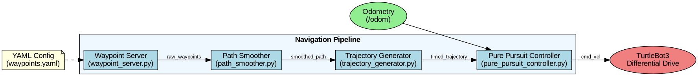

# Path Smoothing and Trajectory Control in 2D Space

A ROS 2 navigation pipeline implementation that transforms discrete waypoints into smooth trajectories with time parameterization for differential drive robots.



## Demonstrations


### Full Pipeline Demonstration

[](https://youtu.be/cK_fbP3ixpg)

*Click the image above to watch the full demonstration on YouTube*

[](https://youtu.be/cK_fbP3ixpg)

## Visualizations

### Gazebo Simulation Environment

*TurtleBot3 in Gazebo simulation environment*

### Path Visualization

*Visualization of waypoints (red), smoothed path (green)*

### Marker Visualization

*RViz visualization showing navigation markers and robot position*

## Overview

This project implements a complete navigation pipeline for autonomous mobile robots in 2D space. It consists of four main components:
1. **Waypoint Server**: Publishes raw waypoints from configuration files
2. **Path Smoother**: Transforms discrete waypoints into smooth continuous paths using Catmull-Rom splines
3. **Trajectory Generator**: Converts geometric paths into time-parameterized trajectories with velocity profiles
4. **Pure Pursuit Controller**: Controls robot motion to follow the generated trajectory

The implementation is based on ROS 2 and has been tested with TurtleBot3 in Gazebo simulation.

## Features

- **Waypoint-based Navigation**: Define paths using simple waypoint coordinates
- **Catmull-Rom Spline Interpolation**: Generate smooth paths through waypoints with continuous curvature
- **Time-optimal Trajectory Generation**: Create trapezoidal velocity profiles within kinematic constraints
- **Pure Pursuit Control**: Track generated trajectories with adaptive lookahead distance
- **Visualization**: Built-in RViz visualization of waypoints, paths, and trajectories
- **Parameter Tuning**: All components have configurable parameters through ROS 2 parameter system

## Prerequisites

- ROS 2 (Tested with ROS 2 Jazzy Jalisco)
- Gazebo Sim (for simulation)
- TurtleBot3 packages
- Python 3.x with NumPy

## Installation

1. Clone the repository into your ROS 2 workspace:
   ```bash
   cd ~/your_ros2_workspace/src
   git clone https://github.com/pheonix-19/Path_Smoothing_and_Trajectory_Control_in_2D_Space.git nav_pipeline
   ```

2. Install dependencies:
   ```bash
   cd ~/your_ros2_workspace
   rosdep install --from-paths src --ignore-src -r -y
   ```

3. Build the package:
   ```bash
   colcon build --packages-select nav_pipeline
   ```

4. Source the setup files:
   ```bash
   source ~/your_ros2_workspace/install/setup.bash
   ```

## Usage

### Running the Full Demo

Launch the full demonstration with TurtleBot3 in Gazebo:

```bash
ros2 launch nav_pipeline full_demo.launch.py
```

This will:
1. Spawn a TurtleBot3 in a Gazebo environment
2. Load a set of waypoints
3. Process them through the navigation pipeline
4. Visualize the results in RViz
5. Control the robot to follow the trajectory

### Pipeline Only (No Robot)

To run just the navigation pipeline components:

```bash
ros2 launch nav_pipeline pipeline_demo.launch.py
```

### Custom Waypoints

Modify the waypoints in `config/waypoints.yaml`:

```yaml
waypoints:
  - [0.0, 0.0]
  - [1.0, 0.0]
  - [1.5, 0.6]
  # Add more waypoints here...
```

Then launch with your custom waypoints:

```bash
ros2 launch nav_pipeline pipeline_demo.launch.py waypoint_file:=/path/to/your_waypoints.yaml
```

## Pipeline Components

### 1. Waypoint Server (`waypoint_server.py`)

- **Purpose**: Load and publish raw waypoints
- **Subscribes**: None
- **Publishes**: `/raw_waypoints` (nav_msgs/Path)
- **Parameters**:
  - `waypoint_file`: Path to YAML file containing waypoints
  - `frame_id`: Coordinate frame of waypoints (default: "map")

### 2. Path Smoother (`path_smoother.py`)

- **Purpose**: Generate smooth path through waypoints
- **Subscribes**: `/raw_waypoints` (nav_msgs/Path)
- **Publishes**: 
  - `/smoothed_path` (nav_msgs/Path)
  - `/smoothed_markers` (visualization_msgs/MarkerArray)
- **Parameters**:
  - `samples_per_segment`: Points per segment for spline interpolation
  - `resample_ds`: Arc length distance for resampling
  - `closed`: Whether path should be closed loop
  - `frame_id`: Coordinate frame for output

### 3. Trajectory Generator (`trajectory_generator.py`)

- **Purpose**: Generate time-parameterized trajectory
- **Subscribes**: `/smoothed_path` (nav_msgs/Path)
- **Publishes**: 
  - `/timed_trajectory` (nav_msgs/Path)
  - `/trajectory_markers` (visualization_msgs/MarkerArray)
- **Parameters**:
  - `v_max`: Maximum linear velocity (m/s)
  - `a_max`: Maximum linear acceleration (m/s²)
  - `publish_rate`: Rate of publishing trajectory (Hz)
  - `frame_id`: Coordinate frame for output

### 4. Pure Pursuit Controller (`pure_pursuit_controller.py`)

- **Purpose**: Control robot to follow trajectory
- **Subscribes**: 
  - `/timed_trajectory` (nav_msgs/Path)
  - `/odom` (nav_msgs/Odometry)
- **Publishes**: `/cmd_vel` (geometry_msgs/Twist)
- **Parameters**:
  - `lookahead`: Lookahead distance for pure pursuit
  - `v_nominal`: Nominal linear velocity
  - `v_min`: Minimum linear velocity
  - `v_max`: Maximum linear velocity
  - `w_max`: Maximum angular velocity
  - `goal_tolerance`: Distance threshold to consider goal reached
  - `control_rate`: Controller update frequency (Hz)

## Algorithm Details

### 🧭 TASK 1 – Path Smoothing

#### 🎯 Goal

Convert raw, discrete waypoints (from config/waypoints.yaml) into a continuous, curvature-smooth path that the robot can later follow.
This avoids jerky motion between waypoints and produces a natural trajectory.

#### 🧱 1️⃣ Setup and Input

Start the simulator and all nodes (if not already running):

```bash
ros2 launch nav_pipeline full_demo.launch.py
```

or run only the smoother pipeline manually:

```bash
# In one terminal: publish waypoints
ros2 run nav_pipeline waypoint_server

# In another terminal: start the smoother
ros2 run nav_pipeline path_smoother
```

Check input waypoints:

```bash
ros2 topic echo --once /raw_waypoints
```

✅ You should see a few discrete (x, y) pairs like:

```
x: 0.0
y: 0.0
x: 1.0
y: 0.5
x: 2.0
y: 1.0
```

These define the coarse skeleton of the desired route.

#### ⚙️ 2️⃣ Core Algorithmic Approach

Step 1 – Duplicate filtering

```
remove any consecutive points where ||Pi+1 − Pi|| < 1e−6
```

Step 2 – Catmull–Rom spline interpolation
For control points P₀,P₁,P₂,P₃,

$t_0 = 0, \; t_1 = t_0 + ||P_1 - P_0||^{\alpha}, \; t_2 = t_1 + ||P_2 - P_1||^{\alpha}, \; t_3 = t_2 + ||P_3 - P_2||^{\alpha}$

with α = 0.5 (centripetal form to avoid overshoot).

Intermediate interpolations:

$A_1 = \frac{t_1 - t}{t_1 - t_0}P_0 + \frac{t - t_0}{t_1 - t_0}P_1,$

$A_2 = \frac{t_2 - t}{t_2 - t_1}P_1 + \frac{t - t_1}{t_2 - t_1}P_2,$

$A_3 = \frac{t_3 - t}{t_3 - t_2}P_2 + \frac{t - t_2}{t_3 - t_2}P_3,$

$B_1 = \frac{t_2 - t}{t_2 - t_0}A_1 + \frac{t - t_0}{t_2 - t_0}A_2,$

$B_2 = \frac{t_3 - t}{t_3 - t_1}A_2 + \frac{t - t_1}{t_3 - t_1}A_3,$

$C(t) = \frac{t_2 - t}{t_2 - t_1}B_1 + \frac{t - t_1}{t_2 - t_1}B_2.$

C(t) yields each interpolated point between P₁ → P₂.

Step 3 – Resample by arc-length
Compute cumulative distance

$S_i = \sum_{k=0}^{i-1} ||C_{k+1} - C_k||$

and interpolate new points every ds = 0.03 m using

```python
resample_by_arclength(points, ds)
```

Step 4 – Clean data
Remove NaNs or repeated (0, 0) entries.

Step 5 – Publish
Publish final path as nav_msgs/Path on /smoothed_path and visual markers on /smoothed_markers.

#### ⚙️ 3️⃣ Node Parameters
| Parameter | Default | Description |
|-----------|---------|-------------|
| frame_id | "odom" | Reference frame |
| samples_per_segment | 15 | Points per spline segment |
| resample_ds | 0.03 m | Distance between resampled points |
| closed | False | Whether to close path loop |

Run-time override example:

```bash
ros2 run nav_pipeline path_smoother --ros-args -p resample_ds:=0.02 -p samples_per_segment:=20
```

#### 🔍 4️⃣ Verification Commands

🧪 Check Output in Terminal
```bash
ros2 topic echo --once /smoothed_path | grep -E "x:|y:"
```

✅ Expected:

```
x: 0.00
y: 0.00
x: 0.05
y: -0.007
x: 0.10
y: -0.014
x: 0.15
y: -0.021
...
```

No alternating zeros, values should change smoothly.

🖥️ Visual Check in RViz

Open RViz (auto-launched or via `rviz2 -d config/nav_pipeline.rviz`).

Fixed Frame → odom

Add Path display:
- Topic /raw_waypoints → Red
- Topic /smoothed_path → Green

🟢 Green curve must pass smoothly through red waypoints.

#### ⚙️ 5️⃣ Common Troubleshooting
| Issue | Probable Cause | Fix |
|-------|---------------|-----|
| Repeated (0, 0) | Duplicate spline boundaries | Ensure filtering after interpolation |
| Jagged path | Too few samples per segment | Increase samples_per_segment |
| Nothing visible in RViz | Wrong fixed frame | Set "odom" |
| Node not found | Environment not sourced | source ~/10x/install/setup.bash |

#### 🧠 6️⃣ Algorithm Summary

Input: /raw_waypoints (discrete)
Processing: duplicate filter → Catmull-Rom spline → arc-length resample → clean
Output: /smoothed_path (continuous, curvature-smooth Path)

#### ✅ 7️⃣ Expected Outcome

- /smoothed_path publishes ≈ 100–200 points (depending on ds).
- Smooth curve connects all waypoints.
- No (0, 0) repeats.
- Ready to feed into Task 2 – Trajectory Generation.

### ⚙️ TASK 2 – Trajectory Generation

#### 🎯 Goal

Generate a time-parameterized trajectory from the smooth geometric path obtained in Task 1.
This assigns timestamps to each point based on a realistic trapezoidal velocity profile, ensuring smooth acceleration and deceleration.

#### 🧱 1️⃣ Input and Output
| Input | Topic | Type |
|-------|-------|------|
| Smoothed path | /smoothed_path | nav_msgs/Path |
| Output trajectory | /timed_trajectory | nav_msgs/Path (with time encoded in orientation.z) |

#### ⚙️ 2️⃣ Run the Node

Start the trajectory generator separately:

```bash
ros2 run nav_pipeline trajectory_generator
```

If you want it inside the full pipeline:

```bash
ros2 launch nav_pipeline full_demo.launch.py
```

#### 🧠 3️⃣ Algorithmic Approach

Step 1 – Read the Smoothed Path

All (x, y) points from /smoothed_path are converted into an ordered array $P = \{P_0, P_1, …, P_n\}$.

Step 2 – Compute Arc Length

For each segment,

$\Delta s_i = ||P_{i+1} - P_i||, S_i = \sum_{k=0}^{i-1} \Delta s_k$.

Total path length = $S_n$.

Step 3 – Define Kinematic Constraints

| Symbol | Meaning | Typical Value |
|--------|---------|---------------|
| $v_{max}$ | Maximum linear velocity | 0.22 m/s (TurtleBot3 nominal) |
| $a_{max}$ | Maximum acceleration | 0.3 m/s² |

Step 4 – Trapezoidal Velocity Profile

- Accelerate until $v_{max}$
  - $v = \sqrt{2a_{max}s}$
- Cruise at $v_{max}$
- Decelerate symmetrically
  - $v = \sqrt{2a_{max}(S_{total} - s)}$
- Compute corresponding time stamps $t_i = s_i / v_i$.

Step 5 – Publish Timed Trajectory

Each pose in /timed_trajectory contains:
- pose.position.x, pose.position.y
- pose.orientation.z = timestamp

This lets the controller know where the robot should be at every instant.

#### 🧩 4️⃣ Node Parameters
| Parameter | Default | Description |
|-----------|---------|-------------|
| v_max | 0.22 | Maximum forward speed (m/s) |
| a_max | 0.3 | Max acceleration (m/s²) |
| ds | 0.03 | Resample distance for timing |

Example:

```bash
ros2 run nav_pipeline trajectory_generator --ros-args -p v_max:=0.25 -p a_max:=0.35
```

#### 🔍 5️⃣ Verification Commands

Check Output

```bash
ros2 topic echo --once /timed_trajectory | grep -E "x:|y:"
```

✅ Expected output:

```
x: 0.00
y: 0.00
x: 0.05
y: -0.007
x: 0.10
y: -0.014
x: 0.15
y: -0.021
...
```

Check number of poses

```bash
ros2 topic echo --once /timed_trajectory | grep -c "x:"
```

✅ Should be ≈ same count as /smoothed_path.

#### 🖥️ 6️⃣ Visualization in RViz

- /smoothed_path → 🟢 Green line
- /timed_trajectory → 🔵 Blue line
  
The blue line should overlap the green one exactly (same geometry, but with time data).

#### ⚙️ 7️⃣ Troubleshooting
| Issue | Cause | Fix |
|-------|-------|-----|
| Still see (0,0) pairs | Unfiltered smooth path | Ensure Task 1 produced clean output |
| Path looks clipped | Wrong resampling interval ds | Reduce to 0.02 m |
| Nothing published | Missing subscription | Launch smoother before generator |

#### 🧠 8️⃣ Summary

- Input: /smoothed_path
- Process: arc-length calc → velocity profile → time assignment
- Output: /timed_trajectory (time-parameterized path)

✅ Produces uniform, realistic motion ready for tracking in Task 3.

### 🕹️ TASK 3 – Pure Pursuit Controller

#### 🎯 Goal

Implement a Pure Pursuit controller to follow the time-parameterized path by publishing Twist commands (/cmd_vel).
The robot continuously adjusts its heading to reach a look-ahead target point on the trajectory.

#### 🧱 1️⃣ Input and Output
| Input Topics | Type | Output Topic | Type |
|--------------|------|-------------|------|
| /timed_trajectory | nav_msgs/Path | /cmd_vel | geometry_msgs/Twist |
| /odom | nav_msgs/Odometry | | |

#### ⚙️ 2️⃣ Run the Controller
```bash
ros2 run nav_pipeline pure_pursuit_controller
```

Or with custom params:

```bash
ros2 run nav_pipeline pure_pursuit_controller --ros-args -p lookahead:=0.8 -p v_nominal:=0.22
```

#### 🧠 3️⃣ Algorithmic Approach

Step 1 – Read Robot Pose
From /odom: position (x, y), heading θ.

Step 2 – Find Target Point
Identify the trajectory point at distance Ld from current pose (look-ahead distance).

Step 3 – Compute Curvature

$\gamma = \frac{2y_{target}}{L_d^2}$

Step 4 – Compute Control Commands

$\omega = v \times \gamma$

where $v$ = nominal linear velocity (0.22 m/s).

Step 5 – Publish Twist

```
geometry_msgs/msg/Twist:
  linear.x  = v
  angular.z = ω
```

Robot moves such that its circular arc intersects the look-ahead target.

#### ⚙️ 4️⃣ Parameters
| Parameter | Default | Description |
|-----------|---------|-------------|
| lookahead | 0.8 m | Preview distance |
| v_nominal | 0.22 m/s | Forward speed |
| frame_id | "odom" | Frame for path tracking |

#### 🔍 5️⃣ Verification Commands

Check velocity output:

```bash
ros2 topic echo --once /cmd_vel
```

✅ Should show:

```
linear:
  x: 0.22
angular:
  z: 0.11
```

Check message type:

```bash
ros2 topic info /cmd_vel
```

✅ Must be only geometry_msgs/msg/Twist.

Confirm topic connections:

```bash
ros2 node info /pure_pursuit_controller
```

#### 🖥️ 6️⃣ Observe in Simulation

In Gazebo and RViz:

- /timed_trajectory (blue) = desired path
- /odom (white) = actual motion

✅ Robot follows trajectory with minimal cross-track error.

#### ⚙️ 7️⃣ Troubleshooting
| Issue | Cause | Fix |
|-------|-------|-----|
| Robot spins in place | Look-ahead too small | Increase to 0.8–1.0 m |
| Overshooting corners | Too high speed | Reduce v_nominal to 0.18 |
| Path not followed | Frame mismatch | Ensure both odom frames |
| "multiple types in /cmd_vel" | Extra bridge publisher | Remove duplicate bridge lines in launch file |

#### 🧠 8️⃣ Summary

- Input: /timed_trajectory, /odom
- Process: compute look-ahead → curvature → velocity commands
- Output: /cmd_vel controlling the robot motion

✅ Robot follows the generated trajectory accurately.
This completes your full navigation pipeline:
Waypoints → Smoothed Path → Timed Trajectory → Controller Motion.

## Parameter Tuning

Key parameters that can be adjusted for better performance:

**Path Smoothing**:
- Increase `samples_per_segment` for smoother paths (but more computational load)
- Decrease `resample_ds` for higher resolution paths

**Trajectory Generation**:
- Adjust `v_max` and `a_max` based on robot capabilities
- Lower values for safer operation, higher values for faster motion

**Pure Pursuit Controller**:
- Increase `lookahead` for smoother but less accurate path following
- Decrease `lookahead` for more precise tracking but potentially more oscillation

## Troubleshooting

**Robot doesn't follow the path correctly**:
- Check if the odometry topic is correctly set
- Adjust the lookahead distance (higher for smoother motion)
- Reduce maximum velocities

**Path appears jagged**:
- Increase `samples_per_segment` in path smoother
- Decrease `resample_ds` for higher resolution

**Robot stops before reaching goal**:
- Check `goal_tolerance` parameter
- Verify that final waypoint is accessible


## Contributors

- Pheonix ([pheonix-19](https://github.com/pheonix-19))

## Acknowledgments

- Based on navigation algorithms for differential drive robots
- Uses ROS 2 framework for robotics integration
- Tested with TurtleBot3 simulation environment